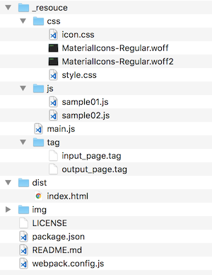

# riot-starter


Start Riot.js easily.  
- [Riot.js](http://riotjs.com)  
- [Materialize](http://materializecss.com)  
- [webpack](https://webpack.js.org)  

<br/>

## Usage



<br/>

Install package

```

npm install

```

<br>

build

```

npm run build

```

<br/>
<br/>


<br/>

## License
MIT

Copyright (c) 2017 Yasunori Kirimoto

<br/>

---

<br/>

### Japanese

<br/>

# Riot.js スターター


Riot.jsを手軽に始める
- [Riot.js](http://riotjs.com)  
- [Materialize](http://materializecss.com)  
- [webpack](https://webpack.js.org)  

<br/>

##  使用方法

パッケージインストール

```

npm install

```

<br>

ビルド

```

npm run build

```

<br/>
<br/>


<br/>

## ライセンス
MIT

Copyright (c) 2017 Yasunori Kirimoto

<br/>
