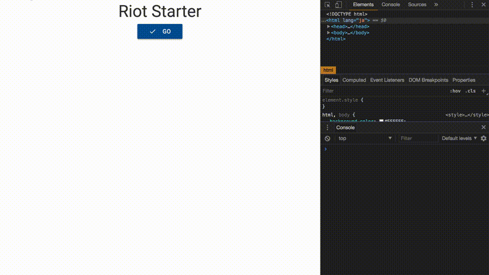

# riot-starter


Start Riot.js easily.

<br/>

## Usage

Install package

```

npm install

```

<br>

build

<br>

```

npm run build

```

<br/>



<br/>

## License
MIT

Copyright (c) 2017 Yasunori Kirimoto

<br/>

---

<br/>

### Japanese

<br/>

# Riot.js スターター


Riot.jsを手軽に始める

<br/>

##  使用方法

パッケージインストール

```

npm install

```

<br>

ビルド

<br>

```

npm run build

```

<br/>


<br/>


## ライセンス
MIT

Copyright (c) 2017 Yasunori Kirimoto

<br/>
